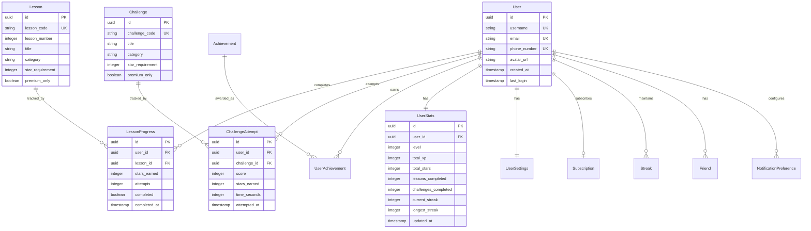

# Data Model

## Document Overview

This document defines the complete data model for the Mahjong learning app, including all entities, relationships, field specifications, and indexing strategies.

**Last Updated:** October 26, 2024

## Entity Relationship Overview



## Core Entities

### 1. User

Primary entity representing a user account.

**Fields:**

| Field | Type | Constraints | Description |
|-------|------|-------------|-------------|
| `id` | UUID | PK, NOT NULL | Unique user identifier |
| `username` | VARCHAR(50) | UNIQUE, NOT NULL | Display name, unique across platform |
| `email` | VARCHAR(255) | UNIQUE, NULLABLE | Email address (null if phone auth) |
| `phone_number` | VARCHAR(20) | UNIQUE, NULLABLE | Phone number with country code |
| `avatar_url` | VARCHAR(500) | NULLABLE | URL to user avatar image |
| `auth_provider` | ENUM | NOT NULL | 'phone', 'email', 'apple', 'google', 'guest' |
| `experience_level` | ENUM | NOT NULL | 'never_played', 'basic_rules', 'played_several', 'experienced' |
| `is_guest` | BOOLEAN | DEFAULT FALSE | True if playing as guest |
| `created_at` | TIMESTAMP | NOT NULL | Account creation timestamp |
| `last_login_at` | TIMESTAMP | NULLABLE | Last login timestamp |
| `deleted_at` | TIMESTAMP | NULLABLE | Soft delete timestamp |

**Indexes:**
- Primary: `id`
- Unique: `username`, `email`, `phone_number`
- Index: `created_at`, `last_login_at`

**Validation Rules:**
- Username: 3-50 characters, alphanumeric + underscore, no spaces
- Email: Valid email format
- Phone: E.164 format (e.g., +15126305766)
- Avatar URL: Valid URL format, max 500 chars

### 2. UserStats

Aggregated statistics and progression data for each user.

**Fields:**

| Field | Type | Constraints | Description |
|-------|------|-------------|-------------|
| `id` | UUID | PK, NOT NULL | Unique stats record identifier |
| `user_id` | UUID | FK, UNIQUE, NOT NULL | Reference to User |
| `level` | INTEGER | DEFAULT 1 | Current user level (1-100+) |
| `total_xp` | INTEGER | DEFAULT 0 | Lifetime XP earned |
| `total_stars` | INTEGER | DEFAULT 0 | Total stars earned |
| `lessons_completed` | INTEGER | DEFAULT 0 | Count of completed lessons |
| `challenges_completed` | INTEGER | DEFAULT 0 | Count of completed challenges |
| `current_streak` | INTEGER | DEFAULT 0 | Current daily login streak |
| `longest_streak` | INTEGER | DEFAULT 0 | Longest streak ever achieved |
| `last_activity_date` | DATE | NULLABLE | Last date user was active |
| `updated_at` | TIMESTAMP | NOT NULL | Last update timestamp |

**Indexes:**
- Primary: `id`
- Unique: `user_id`
- Index: `level`, `total_xp`, `total_stars`

**Business Logic:**
- XP to level calculation: `level = floor(sqrt(total_xp / 100))`
- Level 1: 0-100 XP
- Level 2: 100-400 XP
- Level 3: 400-900 XP
- Level 10: 10,000 XP
- Level 50: 250,000 XP

### 3. UserSettings

User preferences and configuration.

**Fields:**

| Field | Type | Constraints | Description |
|-------|------|-------------|-------------|
| `id` | UUID | PK, NOT NULL | Unique settings identifier |
| `user_id` | UUID | FK, UNIQUE, NOT NULL | Reference to User |
| `tile_theme` | VARCHAR(50) | DEFAULT 'traditional' | Selected tile theme |
| `board_theme` | VARCHAR(50) | DEFAULT 'green' | Board color theme |
| `sound_enabled` | BOOLEAN | DEFAULT TRUE | Sound effects on/off |
| `music_enabled` | BOOLEAN | DEFAULT TRUE | Background music on/off |
| `voice_enabled` | BOOLEAN | DEFAULT TRUE | Voice narration on/off |
| `text_size` | ENUM | DEFAULT 'medium' | 'small', 'medium', 'large' |
| `notifications_enabled` | BOOLEAN | DEFAULT TRUE | Push notifications master toggle |
| `profile_visibility` | ENUM | DEFAULT 'public' | 'public', 'friends', 'private' |
| `created_at` | TIMESTAMP | NOT NULL | Settings creation timestamp |
| `updated_at` | TIMESTAMP | NOT NULL | Last update timestamp |

**Indexes:**
- Primary: `id`
- Unique: `user_id`

### 4. Lesson

Lesson content and metadata.

**Fields:**

| Field | Type | Constraints | Description |
|-------|------|-------------|-------------|
| `id` | UUID | PK, NOT NULL | Unique lesson identifier |
| `lesson_code` | VARCHAR(50) | UNIQUE, NOT NULL | Lesson code (e.g., 'LESSON-01') |
| `lesson_number` | INTEGER | NOT NULL | Sequential lesson number (1-13) |
| `title` | VARCHAR(200) | NOT NULL | Lesson title |
| `category` | ENUM | NOT NULL | 'basics', 'charleston', 'strategy', 'advanced' |
| `star_requirement` | INTEGER | DEFAULT 0 | Stars needed to unlock |
| `premium_only` | BOOLEAN | DEFAULT FALSE | Requires premium subscription |
| `estimated_duration_min` | INTEGER | NOT NULL | Estimated completion time |
| `xp_reward` | INTEGER | NOT NULL | XP awarded for completion |
| `content_url` | VARCHAR(500) | NULLABLE | URL to lesson content JSON |
| `is_published` | BOOLEAN | DEFAULT FALSE | Lesson is live |
| `created_at` | TIMESTAMP | NOT NULL | Lesson creation timestamp |
| `updated_at` | TIMESTAMP | NOT NULL | Last update timestamp |

**Indexes:**
- Primary: `id`
- Unique: `lesson_code`, `lesson_number`
- Index: `category`, `star_requirement`, `is_published`

**Data:**
```json
{
  "lesson_number": 1,
  "lesson_code": "LESSON-01",
  "title": "Welcome to Mahjong",
  "category": "basics",
  "star_requirement": 0,
  "premium_only": false,
  "estimated_duration_min": 5,
  "xp_reward": 100
}
```

### 5. LessonProgress

User progress tracking for each lesson.

**Fields:**

| Field | Type | Constraints | Description |
|-------|------|-------------|-------------|
| `id` | UUID | PK, NOT NULL | Unique progress record identifier |
| `user_id` | UUID | FK, NOT NULL | Reference to User |
| `lesson_id` | UUID | FK, NOT NULL | Reference to Lesson |
| `status` | ENUM | DEFAULT 'not_started' | 'not_started', 'in_progress', 'completed' |
| `stars_earned` | INTEGER | DEFAULT 0 | Stars earned (0-3) |
| `attempts` | INTEGER | DEFAULT 0 | Number of attempts |
| `best_score` | INTEGER | DEFAULT 0 | Highest score achieved |
| `current_screen` | VARCHAR(100) | NULLABLE | Last screen viewed (for resume) |
| `completed_at` | TIMESTAMP | NULLABLE | Completion timestamp |
| `first_attempt_at` | TIMESTAMP | NULLABLE | First attempt timestamp |
| `updated_at` | TIMESTAMP | NOT NULL | Last update timestamp |

**Indexes:**
- Primary: `id`
- Unique: `(user_id, lesson_id)`
- Index: `user_id`, `lesson_id`, `status`, `completed_at`

**Business Logic:**
- Stars based on score/performance (varies by lesson)
- XP awarded on first completion only
- Can retry for better star rating

### 6. Challenge

Challenge definitions and metadata.

**Fields:**

| Field | Type | Constraints | Description |
|-------|------|-------------|-------------|
| `id` | UUID | PK, NOT NULL | Unique challenge identifier |
| `challenge_code` | VARCHAR(50) | UNIQUE, NOT NULL | Challenge code (e.g., 'PATTERN-001') |
| `title` | VARCHAR(200) | NOT NULL | Challenge title |
| `category` | ENUM | NOT NULL | Challenge category |
| `difficulty` | ENUM | NOT NULL | 'easy', 'medium', 'hard' |
| `star_requirement` | INTEGER | DEFAULT 0 | Stars needed to unlock |
| `premium_only` | BOOLEAN | DEFAULT FALSE | Requires premium subscription |
| `estimated_duration_min` | INTEGER | NOT NULL | Estimated completion time |
| `max_score` | INTEGER | NOT NULL | Maximum possible score |
| `xp_reward_base` | INTEGER | NOT NULL | Base XP reward |
| `content_url` | VARCHAR(500) | NULLABLE | URL to challenge content JSON |
| `is_published` | BOOLEAN | DEFAULT FALSE | Challenge is live |
| `created_at` | TIMESTAMP | NOT NULL | Challenge creation timestamp |
| `updated_at` | TIMESTAMP | NOT NULL | Last update timestamp |

**Indexes:**
- Primary: `id`
- Unique: `challenge_code`
- Index: `category`, `difficulty`, `star_requirement`, `is_published`

**Categories:**
- `pattern_recognition`
- `speed`
- `charleston_mastery`
- `card_reading`
- `tile_identification`
- `strategic_decision`
- `memory`
- `completion`

### 7. ChallengeAttempt

User attempts at challenges with scoring.

**Fields:**

| Field | Type | Constraints | Description |
|-------|------|-------------|-------------|
| `id` | UUID | PK, NOT NULL | Unique attempt identifier |
| `user_id` | UUID | FK, NOT NULL | Reference to User |
| `challenge_id` | UUID | FK, NOT NULL | Reference to Challenge |
| `score` | INTEGER | NOT NULL | Score achieved |
| `stars_earned` | INTEGER | NOT NULL | Stars earned (0-3) |
| `time_seconds` | INTEGER | NULLABLE | Time taken in seconds |
| `xp_earned` | INTEGER | NOT NULL | XP awarded for this attempt |
| `attempt_data` | JSONB | NULLABLE | Detailed attempt results |
| `attempted_at` | TIMESTAMP | NOT NULL | Attempt timestamp |

**Indexes:**
- Primary: `id`
- Index: `user_id`, `challenge_id`, `attempted_at`, `score`
- Composite: `(user_id, challenge_id, score DESC)` for personal bests

**Business Logic:**
- Stars based on score thresholds (defined per challenge)
- XP awarded for each attempt (with diminishing returns)
- Track best attempt per user per challenge

### 8. Achievement

Achievement definitions.

**Fields:**

| Field | Type | Constraints | Description |
|-------|------|-------------|-------------|
| `id` | UUID | PK, NOT NULL | Unique achievement identifier |
| `achievement_code` | VARCHAR(50) | UNIQUE, NOT NULL | Achievement code (e.g., 'FIRST_LESSON') |
| `title` | VARCHAR(200) | NOT NULL | Achievement title |
| `description` | TEXT | NOT NULL | Achievement description |
| `category` | ENUM | NOT NULL | 'learning', 'skill', 'social', 'dedication', 'special' |
| `icon_url` | VARCHAR(500) | NULLABLE | Achievement badge icon |
| `xp_reward` | INTEGER | DEFAULT 0 | XP bonus for earning |
| `requirement_type` | VARCHAR(50) | NOT NULL | Type of requirement |
| `requirement_value` | INTEGER | NULLABLE | Required count/value |
| `is_hidden` | BOOLEAN | DEFAULT FALSE | Hidden until earned |
| `created_at` | TIMESTAMP | NOT NULL | Achievement creation timestamp |

**Indexes:**
- Primary: `id`
- Unique: `achievement_code`
- Index: `category`, `is_hidden`

**Example Requirements:**
```json
{
  "achievement_code": "FIRST_LESSON",
  "requirement_type": "lessons_completed",
  "requirement_value": 1
}

{
  "achievement_code": "WEEK_WARRIOR",
  "requirement_type": "streak_days",
  "requirement_value": 7
}

{
  "achievement_code": "PERFECTIONIST",
  "requirement_type": "three_star_lessons",
  "requirement_value": 5
}
```

### 9. UserAchievement

Achievements earned by users.

**Fields:**

| Field | Type | Constraints | Description |
|-------|------|-------------|-------------|
| `id` | UUID | PK, NOT NULL | Unique record identifier |
| `user_id` | UUID | FK, NOT NULL | Reference to User |
| `achievement_id` | UUID | FK, NOT NULL | Reference to Achievement |
| `earned_at` | TIMESTAMP | NOT NULL | When achievement was earned |
| `shown_to_user` | BOOLEAN | DEFAULT FALSE | Modal shown to user |

**Indexes:**
- Primary: `id`
- Unique: `(user_id, achievement_id)`
- Index: `user_id`, `earned_at`

### 10. Streak

Daily activity streak tracking.

**Fields:**

| Field | Type | Constraints | Description |
|-------|------|-------------|-------------|
| `id` | UUID | PK, NOT NULL | Unique streak record identifier |
| `user_id` | UUID | FK, NOT NULL | Reference to User |
| `activity_date` | DATE | NOT NULL | Date of activity |
| `streak_count` | INTEGER | NOT NULL | Streak length on this date |
| `shield_used` | BOOLEAN | DEFAULT FALSE | Streak shield was used |
| `created_at` | TIMESTAMP | NOT NULL | Record creation timestamp |

**Indexes:**
- Primary: `id`
- Unique: `(user_id, activity_date)`
- Index: `user_id`, `activity_date DESC`

**Business Logic:**
- Record created on first activity each day
- Streak increments if activity within 24-48 hours
- Streak resets if >48 hours without activity (unless shield)
- Shield can protect one missed day

### 11. Friend

Friend relationships between users.

**Fields:**

| Field | Type | Constraints | Description |
|-------|------|-------------|-------------|
| `id` | UUID | PK, NOT NULL | Unique relationship identifier |
| `user_id` | UUID | FK, NOT NULL | User who sent/accepted request |
| `friend_id` | UUID | FK, NOT NULL | User who received/sent request |
| `status` | ENUM | NOT NULL | 'pending', 'accepted', 'blocked' |
| `requested_by` | UUID | FK, NOT NULL | User who initiated request |
| `requested_at` | TIMESTAMP | NOT NULL | Request timestamp |
| `accepted_at` | TIMESTAMP | NULLABLE | Acceptance timestamp |

**Indexes:**
- Primary: `id`
- Unique: `(user_id, friend_id)` or `(friend_id, user_id)`
- Index: `user_id`, `friend_id`, `status`

**Constraints:**
- Enforce bidirectional relationship (create two rows or use CHECK)
- Prevent self-friendship: `user_id != friend_id`

### 12. Subscription

Premium subscription management.

**Fields:**

| Field | Type | Constraints | Description |
|-------|------|-------------|-------------|
| `id` | UUID | PK, NOT NULL | Unique subscription identifier |
| `user_id` | UUID | FK, UNIQUE, NOT NULL | Reference to User |
| `plan_type` | ENUM | NOT NULL | 'free_trial', 'monthly', 'yearly' |
| `status` | ENUM | NOT NULL | 'active', 'canceled', 'expired', 'paused' |
| `started_at` | TIMESTAMP | NOT NULL | Subscription start date |
| `expires_at` | TIMESTAMP | NOT NULL | Expiration/renewal date |
| `canceled_at` | TIMESTAMP | NULLABLE | Cancellation timestamp |
| `payment_provider` | VARCHAR(50) | NULLABLE | 'apple', 'google', 'stripe' |
| `external_subscription_id` | VARCHAR(255) | NULLABLE | Provider's subscription ID |
| `auto_renew` | BOOLEAN | DEFAULT TRUE | Auto-renewal enabled |
| `created_at` | TIMESTAMP | NOT NULL | Record creation timestamp |
| `updated_at` | TIMESTAMP | NOT NULL | Last update timestamp |

**Indexes:**
- Primary: `id`
- Unique: `user_id`
- Index: `status`, `expires_at`, `external_subscription_id`

**Business Logic:**
- Free tier: status = NULL (no subscription record)
- Free trial: 7 days, one-time per user
- Check `expires_at` for active premium status
- Auto-renew handled by payment provider webhooks

### 13. NotificationPreference

User notification settings.

**Fields:**

| Field | Type | Constraints | Description |
|-------|------|-------------|-------------|
| `id` | UUID | PK, NOT NULL | Unique preference identifier |
| `user_id` | UUID | FK, UNIQUE, NOT NULL | Reference to User |
| `push_enabled` | BOOLEAN | DEFAULT TRUE | Push notifications enabled |
| `email_enabled` | BOOLEAN | DEFAULT TRUE | Email notifications enabled |
| `lesson_complete` | BOOLEAN | DEFAULT TRUE | Notify on lesson completion |
| `challenge_unlock` | BOOLEAN | DEFAULT TRUE | Notify when challenges unlock |
| `streak_reminder` | BOOLEAN | DEFAULT TRUE | Daily streak reminder |
| `friend_activity` | BOOLEAN | DEFAULT TRUE | Friend milestone notifications |
| `marketing` | BOOLEAN | DEFAULT FALSE | Marketing/promotional emails |
| `created_at` | TIMESTAMP | NOT NULL | Record creation timestamp |
| `updated_at` | TIMESTAMP | NOT NULL | Last update timestamp |

**Indexes:**
- Primary: `id`
- Unique: `user_id`

### 14. DailyChallenge

Special daily challenge rotation.

**Fields:**

| Field | Type | Constraints | Description |
|-------|------|-------------|-------------|
| `id` | UUID | PK, NOT NULL | Unique daily challenge identifier |
| `challenge_date` | DATE | UNIQUE, NOT NULL | Date for this daily challenge |
| `challenge_id` | UUID | FK, NOT NULL | Reference to Challenge |
| `bonus_xp` | INTEGER | DEFAULT 0 | Bonus XP for daily completion |
| `created_at` | TIMESTAMP | NOT NULL | Record creation timestamp |

**Indexes:**
- Primary: `id`
- Unique: `challenge_date`
- Index: `challenge_date DESC`

## Relationships Summary

### One-to-One Relationships
- `User` ↔ `UserStats`
- `User` ↔ `UserSettings`
- `User` ↔ `Subscription` (optional)
- `User` ↔ `NotificationPreference`

### One-to-Many Relationships
- `User` → Many `LessonProgress`
- `User` → Many `ChallengeAttempt`
- `User` → Many `UserAchievement`
- `User` → Many `Streak`
- `User` → Many `Friend`
- `Lesson` → Many `LessonProgress`
- `Challenge` → Many `ChallengeAttempt`
- `Achievement` → Many `UserAchievement`

### Many-to-Many Relationships
- `User` ↔ `Friend` (self-referential many-to-many)
- `User` ↔ `Achievement` (through `UserAchievement`)

## Common Queries

### 1. Get User Dashboard Data

```sql
SELECT
  u.id,
  u.username,
  u.avatar_url,
  us.level,
  us.total_xp,
  us.total_stars,
  us.current_streak,
  us.lessons_completed,
  us.challenges_completed,
  s.plan_type,
  s.status AS subscription_status,
  s.expires_at
FROM users u
LEFT JOIN user_stats us ON u.id = us.user_id
LEFT JOIN subscriptions s ON u.id = s.user_id
WHERE u.id = ?;
```

### 2. Get Available Lessons for User

```sql
SELECT
  l.id,
  l.lesson_number,
  l.title,
  l.category,
  l.star_requirement,
  l.premium_only,
  lp.status,
  lp.stars_earned,
  CASE
    WHEN us.total_stars >= l.star_requirement THEN TRUE
    ELSE FALSE
  END AS is_unlocked,
  CASE
    WHEN l.premium_only AND (s.status IS NULL OR s.status != 'active') THEN FALSE
    ELSE TRUE
  END AS has_access
FROM lessons l
LEFT JOIN lesson_progress lp ON l.id = lp.lesson_id AND lp.user_id = ?
LEFT JOIN user_stats us ON us.user_id = ?
LEFT JOIN subscriptions s ON s.user_id = ?
WHERE l.is_published = TRUE
ORDER BY l.lesson_number;
```

### 3. Get User's Challenge Performance

```sql
SELECT
  c.id,
  c.title,
  c.category,
  COUNT(ca.id) AS attempts,
  MAX(ca.score) AS best_score,
  MAX(ca.stars_earned) AS best_stars,
  MIN(ca.time_seconds) AS best_time
FROM challenges c
LEFT JOIN challenge_attempts ca ON c.id = ca.challenge_id AND ca.user_id = ?
WHERE c.is_published = TRUE
GROUP BY c.id, c.title, c.category
ORDER BY c.challenge_code;
```

### 4. Check and Update Streak

```sql
-- Get last activity
SELECT activity_date, streak_count
FROM streaks
WHERE user_id = ?
ORDER BY activity_date DESC
LIMIT 1;

-- Insert new streak record (if within 48 hours)
INSERT INTO streaks (id, user_id, activity_date, streak_count)
VALUES (gen_random_uuid(), ?, CURRENT_DATE, ?);

-- Update user stats
UPDATE user_stats
SET current_streak = ?,
    longest_streak = GREATEST(longest_streak, ?),
    last_activity_date = CURRENT_DATE
WHERE user_id = ?;
```

### 5. Get Leaderboard (Global)

```sql
SELECT
  u.id,
  u.username,
  u.avatar_url,
  us.level,
  us.total_xp,
  us.total_stars,
  RANK() OVER (ORDER BY us.total_stars DESC, us.total_xp DESC) AS rank
FROM users u
JOIN user_stats us ON u.id = us.user_id
JOIN user_settings uset ON u.id = uset.user_id
WHERE uset.profile_visibility = 'public'
  AND u.is_guest = FALSE
ORDER BY rank
LIMIT 100;
```

### 6. Check Achievement Progress

```sql
-- Example: Check if user earned "Complete 5 Lessons"
SELECT
  COUNT(*) AS lessons_completed
FROM lesson_progress
WHERE user_id = ?
  AND status = 'completed';

-- If threshold met, insert achievement
INSERT INTO user_achievements (id, user_id, achievement_id, earned_at)
SELECT
  gen_random_uuid(),
  ?,
  a.id,
  NOW()
FROM achievements a
WHERE a.achievement_code = 'FIVE_LESSONS'
  AND NOT EXISTS (
    SELECT 1 FROM user_achievements ua
    WHERE ua.user_id = ? AND ua.achievement_id = a.id
  )
  AND (SELECT COUNT(*) FROM lesson_progress WHERE user_id = ? AND status = 'completed') >= 5;
```

### 7. Get Friend Activity Feed

```sql
SELECT
  u.id,
  u.username,
  u.avatar_url,
  'lesson_completed' AS activity_type,
  l.title AS activity_title,
  lp.completed_at AS activity_timestamp
FROM friends f
JOIN users u ON (f.friend_id = u.id)
JOIN lesson_progress lp ON u.id = lp.user_id
JOIN lessons l ON lp.lesson_id = l.id
WHERE f.user_id = ?
  AND f.status = 'accepted'
  AND lp.completed_at > NOW() - INTERVAL '7 days'
UNION ALL
SELECT
  u.id,
  u.username,
  u.avatar_url,
  'achievement_earned' AS activity_type,
  a.title AS activity_title,
  ua.earned_at AS activity_timestamp
FROM friends f
JOIN users u ON (f.friend_id = u.id)
JOIN user_achievements ua ON u.id = ua.user_id
JOIN achievements a ON ua.achievement_id = a.id
WHERE f.user_id = ?
  AND f.status = 'accepted'
  AND ua.earned_at > NOW() - INTERVAL '7 days'
ORDER BY activity_timestamp DESC
LIMIT 50;
```

## Data Validation & Constraints

### Application-Level Validation

**User Registration:**
- Username: 3-50 chars, alphanumeric + underscore
- Email: Valid email format
- Phone: E.164 format
- Check username/email/phone uniqueness before insert

**Lesson/Challenge Completion:**
- Validate user has access (stars + premium status)
- Validate score is within valid range
- Calculate stars based on score thresholds
- Award XP based on completion type

**Streak Management:**
- Calculate streak based on last_activity_date
- Apply shield if available and needed
- Update longest_streak if current exceeds it

**Friend Management:**
- Prevent self-friendship
- Check friend limit (10 for free, unlimited for premium)
- Create bidirectional relationship

### Database Constraints

```sql
-- User table
ALTER TABLE users
  ADD CONSTRAINT chk_username_format
    CHECK (username ~ '^[a-zA-Z0-9_]{3,50}$'),
  ADD CONSTRAINT chk_email_or_phone
    CHECK (email IS NOT NULL OR phone_number IS NOT NULL);

-- Friend table
ALTER TABLE friends
  ADD CONSTRAINT chk_no_self_friend
    CHECK (user_id != friend_id);

-- LessonProgress
ALTER TABLE lesson_progress
  ADD CONSTRAINT chk_stars_range
    CHECK (stars_earned >= 0 AND stars_earned <= 3),
  ADD CONSTRAINT chk_attempts_positive
    CHECK (attempts >= 0);

-- ChallengeAttempt
ALTER TABLE challenge_attempts
  ADD CONSTRAINT chk_stars_range
    CHECK (stars_earned >= 0 AND stars_earned <= 3),
  ADD CONSTRAINT chk_score_positive
    CHECK (score >= 0);

-- UserStats
ALTER TABLE user_stats
  ADD CONSTRAINT chk_level_positive
    CHECK (level >= 1),
  ADD CONSTRAINT chk_xp_positive
    CHECK (total_xp >= 0),
  ADD CONSTRAINT chk_stars_positive
    CHECK (total_stars >= 0),
  ADD CONSTRAINT chk_streak_positive
    CHECK (current_streak >= 0 AND longest_streak >= 0);
```

## Indexing Strategy

### Performance Indexes

```sql
-- User lookups
CREATE INDEX idx_users_username ON users(username);
CREATE INDEX idx_users_email ON users(email);
CREATE INDEX idx_users_phone ON users(phone_number);
CREATE INDEX idx_users_last_login ON users(last_login_at);

-- Progress queries
CREATE INDEX idx_lesson_progress_user ON lesson_progress(user_id);
CREATE INDEX idx_lesson_progress_lesson ON lesson_progress(lesson_id);
CREATE INDEX idx_lesson_progress_completed ON lesson_progress(user_id, completed_at) WHERE status = 'completed';

-- Challenge leaderboards
CREATE INDEX idx_challenge_attempts_score ON challenge_attempts(challenge_id, score DESC);
CREATE INDEX idx_challenge_attempts_user_best ON challenge_attempts(user_id, challenge_id, score DESC);

-- Streak tracking
CREATE INDEX idx_streaks_user_date ON streaks(user_id, activity_date DESC);

-- Achievements
CREATE INDEX idx_user_achievements_user ON user_achievements(user_id, earned_at DESC);

-- Friends
CREATE INDEX idx_friends_user ON friends(user_id) WHERE status = 'accepted';
CREATE INDEX idx_friends_status ON friends(user_id, status);

-- Subscriptions
CREATE INDEX idx_subscriptions_active ON subscriptions(user_id, expires_at) WHERE status = 'active';
```

## Caching Strategy

### Cache Keys

**User Profile:**
- Key: `user:{user_id}:profile`
- TTL: 5 minutes
- Invalidate: On user update

**User Stats:**
- Key: `user:{user_id}:stats`
- TTL: 1 minute
- Invalidate: On XP/star/level change

**Lesson List:**
- Key: `lessons:published`
- TTL: 1 hour
- Invalidate: On lesson publish/update

**Challenge List:**
- Key: `challenges:published`
- TTL: 1 hour
- Invalidate: On challenge publish/update

**User Progress:**
- Key: `user:{user_id}:progress`
- TTL: 5 minutes
- Invalidate: On lesson/challenge completion

**Leaderboard:**
- Key: `leaderboard:global:stars`
- TTL: 15 minutes
- Invalidate: Scheduled refresh

## Data Retention & Privacy

### Soft Deletes

Users can delete their accounts with 30-day recovery window:
- Set `users.deleted_at = NOW()`
- Hide from all public queries
- Permanent delete after 30 days (GDPR compliance)

### Data Export

Users can request data export (GDPR):
- Generate JSON dump of all user data
- Include: profile, progress, attempts, achievements, friends
- Exclude: other users' private data

### Anonymization

On permanent delete:
- Replace username with `deleted_user_{uuid}`
- Remove email, phone, avatar
- Keep aggregate stats for analytics (anonymized)
- Preserve challenge attempts for leaderboard integrity

## Migration Considerations

### Initial Schema

1. Create all tables in order of dependencies
2. Add indexes after initial data load
3. Add foreign key constraints last

### Seed Data

**Lessons:**
- Load 13 lesson definitions
- Set star requirements
- Mark lessons 1-4 as always available

**Challenges:**
- Load all 32 challenge definitions
- Set unlock requirements
- Configure scoring thresholds

**Achievements:**
- Load 50+ achievement definitions
- Set requirement types and values

### Performance Monitoring

**Slow Query Candidates:**
- Leaderboard queries (consider materialized views)
- Friend activity feeds (consider pre-computed feed tables)
- Achievement checks (consider event-driven triggers)

**Optimization Strategies:**
- Materialized views for leaderboards (refresh every 15 min)
- Redis cache for hot data (user stats, progress)
- Denormalize frequent aggregations (user stats)
- Partition large tables by date (challenge_attempts, streaks)

**End of Document**
