This document provides a comprehensive map of all screens, pages, and navigation flows in the Mahjong learning app. It includes conditional states, locked content, and user journey paths.

**Last Updated:** October 26, 2024

## Page Inventory

### 1. Onboarding & Authentication

**1.1 Welcome/Auth Screen**

- `auth-welcome` - Initial splash screen with branding
    - "Learn Mahjong. Have Fun!" headline
    - Phone number input with country code selector
    - "OR" divider
    - "Continue with email" button
    - "Continue with Apple" button
    - "Continue with Google" button
    - "Play as Guest" option at bottom
    - "Log In" button in top right corner

**1.2 Phone Authentication Flow**

- `auth-phone-entry` - Enter phone number
    - Country code selector
    - Phone number input field
    - "We will send you an SMS with a confirmation code" helper text
    - "Continue" button
- `auth-pin-verification` - Verify SMS code
    - 6-digit code input boxes
    - Shows phone number code was sent to
    - "Resend [countdown]" button
    - Displays SMS source info
    - Back button in top left

**1.3 Email Authentication Flow**

- `auth-email-entry` - Enter email address
- `auth-email-verification` - Email confirmation link sent
- `auth-forgot-password` - Password reset flow

**1.4 Profile Setup**

- `onboarding-username` - Choose username and avatar
    - "Choose a Username" headline
    - "This is what other players will see" helper text
    - Avatar upload button (camera icon)
    - Username input field
    - "By signing up, I accept the Terms of Service" text
    - "Continue" button
    - Back button in top left

**1.5 Personalization**

- `onboarding-experience` - Mahjong experience level
    - "What Is Your Mahjong Experience?" headline
    - 4 options with tile icons:
        - "I've never played before"
        - "I know the basic rules"
        - "I've played several times"
        - "I'm an experienced player"
    - "Continue" button at bottom
    - Back button in top left

- `onboarding-tile-theme` - Choose tile/board theme
    - "Choose Your Tile Theme" headline
    - "You can change this later in settings" helper text
    - 4-6 theme options with visual previews (e.g., Traditional, Modern, Colorful, High Contrast)
    - Selected theme has checkmark and highlight border
    - "Continue" button at bottom
    - Back button in top left

**1.6 Social (Optional)**

- `onboarding-find-friends` - Find friends to connect with
    - "Find More Friends" headline
    - "Search Facebook" option
    - "Send Email Invite" option
    - Search bar: "Phone Number, Email or Username"
    - "Skip" button at bottom (allows skipping this step)
    - Back button in top left

**1.7 Free Trial Offer**

- `onboarding-free-trial` - Premium trial offer
    - "Get Started with 1 Free Week of Premium" headline
    - List of premium benefits with checkmarks:
        - "Unlimited Challenges"
        - "All Lessons Unlocked"
        - "Advanced Statistics"
        - "No Ads"
    - Illustration/icon representing premium features
    - Toggle: "Yearly" / "Monthly" pricing display
    - "$XX.XX/yr ($X.XX/mo) after free trial. Cancel anytime." text
    - "Redeem 1 Week Free" primary button
    - "No, thank you" secondary option
    - Back button in top left

**1.8 Permissions**

- `onboarding-notifications` - Notification permissions
    - "Get Notified About Your Progress" headline
    - Example notification preview card
    - "Choose 'ALLOW' to get notified when:" headline
    - Bullet points:
        - "You complete a lesson"
        - "New challenges unlock"
        - "Your streak is at risk"
        - "Friends achieve milestones"
    - "OK" primary button (triggers system permission)
    - "No, thank you" secondary option
    - Back button in top left

**Conditional Screens:**

- `auth-account-exists` - Account already exists for phone/email
- `auth-invalid-code` - SMS verification code incorrect
- `auth-code-expired` - SMS verification code expired
- `onboarding-username-taken` - Username already in use

### 2. Main Navigation Hub

**2.1 Primary Tabs (Bottom Navigation)**

- `home` - Dashboard/main hub
- `lessons` - Lesson library
- `challenges` - Challenge library
- `profile` - User profile and settings

### 3. Home/Dashboard Screens

**3.1 Main Dashboard**

- `home-dashboard` - Main landing screen after login
    - Current level and XP progress
    - Active streak display
    - Continue learning prompt
    - Quick access to next lesson/challenge
    - Daily challenge card
    - Recent achievements
    - Friend activity feed

**3.2 Dashboard Modals**

- `level-up-celebration` - Modal when user levels up
- `achievement-unlocked` - Modal when achievement earned
- `streak-milestone` - Modal for streak achievements

**Conditional Screens:**

- `streak-broken-notification` - Shown when streak ends
- `premium-prompt-dashboard` - Upgrade CTA on dashboard

### 4. Lesson Screens

**4.1 Lesson Library**

- `lessons-home` - All lessons overview
- `lessons-category-view` - Lessons grouped by category
    - Basics (Lessons 1-4)
    - Charleston (Lessons 5-7)
    - Strategy (Lessons 8-10)
    - Advanced (Lessons 11-13)

**4.2 Individual Lesson Flow**

- `lesson-intro` - Lesson overview and objectives
- `lesson-content-screen` - Interactive content screens (varies per lesson)
- `lesson-practice-exercise` - Hands-on exercises within lesson
- `lesson-completion` - Summary and star rating
- `lesson-reward` - XP and unlock notifications

**4.3 Lesson States**

- `lesson-locked` - Not yet unlocked (star requirement not met)
- `lesson-in-progress` - Partially completed
- `lesson-completed-1-star` - Completed with 1 star
- `lesson-completed-2-star` - Completed with 2 stars
- `lesson-completed-3-star` - Completed with 3 stars
- `lesson-retry-prompt` - Offer to replay for better score

**Conditional Screens:**

- `lesson-unlock-requirement` - Shows how many stars needed
- `lesson-premium-locked` - Premium-only lessons (for free users)
- `lesson-pause-confirmation` - Confirm exit mid-lesson

### 5. Challenge Screens

**5.1 Challenge Library**

- `challenges-home` - All challenges overview with categories
- `challenges-by-category` - Filtered view
    - Pattern Recognition (6 challenges)
    - Speed Challenges (4 challenges)
    - Charleston Mastery (5 challenges)
    - Card Reading (4 challenges)
    - Tile Identification (4 challenges)
    - Strategic Decision (4 challenges)
    - Memory Challenges (3 challenges)
    - Completion Challenges (4 challenges)
- `challenge-detail` - Individual challenge preview

**5.2 Challenge Flow**

- `challenge-intro` - Rules and objectives
- `challenge-gameplay` - Active challenge screen (varies by type)
- `challenge-round-feedback` - Feedback after each scenario
- `challenge-completion` - Final score and star rating

**5.3 Challenge States**

- `challenge-locked` - Shows unlock requirement
- `challenge-new` - Never attempted
- `challenge-completed-stars` - 1-3 star indicators

**Conditional Screens:**

- `challenge-premium-locked` - Premium-only challenges
- `challenge-star-requirement` - Need X stars to unlock
- `challenge-failed` - Didn't meet minimum requirements
- `tournament-entry-confirm` - One attempt per week confirmation

### 6. Profile & Progression Screens

**6.1 User Profile**

- `profile-overview` - Main profile page
    - Level and XP bar
    - Total stars earned
    - Current streak
    - Achievements showcase
    - Statistics overview
- `profile-edit` - Edit name, avatar, preferences
- `profile-statistics` - Detailed stats
    - Lessons completed
    - Challenges completed
    - Games played
    - Win rate
    - Average completion time

**6.2 Achievements**

- `achievements-home` - All achievements grid
- `achievements-by-category` - Filtered view
    - Learning achievements
    - Skill achievements
    - Social achievements
    - Dedication achievements
    - Special achievements
- `achievement-detail` - Individual achievement info and progress

**6.3 Streak & Daily Activity**

- `streak-calendar` - Visual streak history

### 7. Social Screens

**7.2 Sharing**

- `share-achievement` - Share to social media
- `share-score` - Share challenge score
- `share-progress` - Share overall progress
- `share-invite` - Invite friends to app

### 8. Premium & Monetization Screens

**8.1 Premium Subscription**

- `premium-landing` - Main upgrade page with benefits
- `premium-comparison` - Free vs Premium table
- `premium-checkout` - Payment flow
- `premium-confirmation` - Purchase successful
- `premium-manage` - Manage subscription

**8.2 Paywalls & Prompts**

- `paywall-advanced-lessons` - Premium lesson gate
- `paywall-unlimited-challenges` - Challenge attempt limit
- `paywall-hints` - Hint system gate
- `paywall-game-analysis` - Post-game analysis gate
- `paywall-ad-free` - Remove ads prompt
- `paywall-streak-shield` - Streak protection purchase

**8.3 Purchase Flows**

- `purchase-stars` - Buy star packs (premium)
- `purchase-cosmetics` - Avatar items, themes

**Conditional Screens:**

- `subscription-expired` - Lapsed premium user
- `restore-purchases` - iOS restore button
- `payment-failed` - Transaction error

### 9. Settings & Support Screens

**9.1 Settings**

- `settings-home` - Main settings menu
- `settings-account` - Email, password, delete account
- `settings-notifications` - Notification preferences
- `settings-display` - Tile style, theme, text size
- `settings-audio` - Sound effects, music, voice
- `settings-gameplay` - Hints, speed, difficulty defaults
- `settings-privacy` - Data sharing, profile visibility
- `settings-subscription` - Manage premium

**9.2 Legal**

- `terms-of-service` - TOS document
- `privacy-policy` - Privacy policy
- `about` - App version, credits, licenses

**Conditional Screens:**

- `account-deletion-confirm` - Confirm delete account
- `data-export` - Request data download (GDPR)

### 10. Error & Edge Case Screens

**10.1 System Errors**

- `error-no-internet` - Offline state
- `error-server` - Backend error
- `error-maintenance` - Scheduled maintenance
- `error-update-required` - Force update

**10.2 Empty States**

- `achievements-empty` - No achievements yet
- `friends-empty` - No friends yet
- `challenges-none-available` - All locked or completed
- `leaderboard-empty` - No data yet

**10.3 Loading States**

- `loading-splash` - App initialization
- `loading-content` - General content loading
- `loading-game` - Game setup

## Navigation Flows

### Onboarding Flow Pattern

New users go through a **streamlined 8-step onboarding** sequence:

1. **Auth Welcome** - Choose sign-up method (phone, email, social, or guest)
2. **Authentication** - Phone PIN verification, email verification, or social auth
3. **Profile Setup** - Choose username and avatar
4. **Experience Level** - Select Mahjong skill level (4 options)
5. **Tile Theme** - Choose visual theme preference
6. **Find Friends** - Optional friend connection (can skip)
7. **Free Trial** - Premium trial offer (can decline)
8. **Notifications** - Request notification permissions (can decline)

This pattern follows industry best practices (Chess.com, Duolingo) with clear progress, back navigation available, and skippable optional steps.

### Primary Navigation Pattern

The app uses a **tab-based navigation** system with 4 primary tabs at the bottom:

1. **Home** - Dashboard and daily activities
2. **Lessons** - Learning content
3. **Challenges** - Skill-building exercises
4. **Profile** - User stats and settings

### Modal Navigation

Certain screens appear as **modals/overlays** above the main navigation:

- Celebrations (level up, achievements)
- Paywalls and premium prompts
- Settings and help
- Social sharing
- Confirmation dialogs

### Deep Linking

The app supports deep links for:

- Specific lessons: `app://lesson/{lesson-id}`
- Specific challenges: `app://challenge/{challenge-id}`
- User profiles: `app://profile/{user-id}`
- Achievement sharing: `app://achievement/{achievement-id}`
- Daily challenge: `app://daily-challenge`

## User Navigation Flow (Mermaid)

```mermaid
graph TD
    Start([App Launch]) --> CheckAuth{Authenticated?}

    CheckAuth -->|No| AuthWelcome[Auth Welcome Screen]
    AuthWelcome -->|Phone| PhoneEntry[Enter Phone Number]
    AuthWelcome -->|Email| EmailEntry[Enter Email]
    AuthWelcome -->|Apple/Google| SocialAuth[Social Sign-In]
    AuthWelcome -->|Guest| Dashboard
    AuthWelcome -->|Log In| LoginFlow[Login Screen]

    PhoneEntry --> PinVerify[Verify SMS Code]
    PinVerify -->|Valid Code| UsernameSetup[Choose Username + Avatar]
    PinVerify -->|Invalid| PinError[Invalid Code Error]
    PinError --> PinVerify

    EmailEntry --> EmailVerify[Email Verification]
    EmailVerify --> UsernameSetup

    SocialAuth --> UsernameSetup

    UsernameSetup -->|Valid Username| ExperienceLevel[Select Experience Level]
    UsernameSetup -->|Taken| UsernameTakenError[Username Taken]
    UsernameTakenError --> UsernameSetup
    ExperienceLevel --> TileTheme[Choose Tile Theme]
    TileTheme --> FindFriends[Find Friends - Optional]

    FindFriends -->|Skip or Continue| FreeTrialOffer[Free Trial Offer]
    FreeTrialOffer -->|Accept Trial| NotificationPerms[Notification Permissions]
    FreeTrialOffer -->|Decline| NotificationPerms

    NotificationPerms --> Dashboard[Home Dashboard]
    LoginFlow --> Dashboard

    CheckAuth -->|Yes| Dashboard

    Dashboard --> TabHome[Home Tab]
    Dashboard --> TabLessons[Lessons Tab]
    Dashboard --> TabChallenges[Challenges Tab]
    Dashboard --> TabProfile[Profile Tab]

    %% Home Tab Flow
    TabHome --> ContinueLearning[Continue Learning]
    TabHome --> ViewStreakHome[View Streak]
    TabHome --> QuickChallenge[Quick Challenge Access]

    ContinueLearning --> NextLesson[Next Incomplete Lesson]
    NextLesson --> LessonFlow
    QuickChallenge --> ChallengeLibrary

    %% Lessons Tab Flow
    TabLessons --> LessonLibrary[Lesson Library]
    LessonLibrary --> SelectLesson[Select Lesson]
    SelectLesson --> CheckLessonLock{Lesson Locked?}

    CheckLessonLock -->|Yes - Free User| CheckPremium1{Premium Lesson?}
    CheckPremium1 -->|Yes| PaywallLesson[Premium Paywall]
    CheckPremium1 -->|No| LessonLocked[Star Requirement]

    CheckLessonLock -->|No| LessonFlow

    LessonFlow[Lesson Intro] --> LessonContent[Interactive Content]
    LessonContent --> LessonExercise[Practice Exercise]
    LessonExercise --> LessonComplete[Completion & Stars]
    LessonComplete --> LessonReward[XP Reward]

    LessonReward --> CheckLevelUp{Level Up?}
    CheckLevelUp -->|Yes| LevelUpModal[Level Up Celebration]
    CheckLevelUp -->|No| RetryPrompt{Retry for More Stars?}

    LevelUpModal --> RetryPrompt
    RetryPrompt -->|Yes| LessonFlow
    RetryPrompt -->|No| BackToLessons[Back to Lesson Library]
    BackToLessons --> TabLessons

    PaywallLesson --> ViewPremium[View Premium Benefits]
    ViewPremium --> UpgradeFlow

    %% Challenges Tab Flow
    TabChallenges --> ChallengeLibrary[Challenge Library]
    ChallengeLibrary --> ChallengeCategory[Select Category]
    ChallengeCategory --> SelectChallenge[Select Challenge]
    SelectChallenge --> CheckChallengeLock{Challenge Locked?}

    CheckChallengeLock -->|Yes - Stars| ChallengeLocked[Star Requirement]
    CheckChallengeLock -->|Yes - Premium| PaywallChallenge[Premium Paywall]
    CheckChallengeLock -->|No| CheckAttempts{Attempts Available?}

    CheckAttempts -->|No - Free User| PaywallAttempts[Upgrade for Unlimited]
    CheckAttempts -->|Yes| ChallengeFlow

    ChallengeFlow[Challenge Intro] --> ChallengeGameplay[Challenge Gameplay]
    ChallengeGameplay --> RoundFeedback[Round Feedback]
    RoundFeedback --> CheckMoreRounds{More Rounds?}

    CheckMoreRounds -->|Yes| ChallengeGameplay
    CheckMoreRounds -->|No| ChallengeComplete[Final Score & Stars]

    ChallengeComplete --> ChallengeReward[XP Reward]
    ChallengeReward --> SharePrompt{Share Score?}

    SharePrompt -->|Yes| ShareScore[Share to Social]
    SharePrompt -->|No| BackToChallenges[Back to Challenges]
    ShareScore --> BackToChallenges
    BackToChallenges --> TabChallenges

    PaywallChallenge --> ViewPremium
    PaywallAttempts --> ViewPremium

    %% Profile Tab Flow
    TabProfile --> ProfileOverview[Profile Overview]
    ProfileOverview --> ProfileStats[View Statistics]
    ProfileOverview --> ViewAchievements[View Achievements]
    ProfileOverview --> ViewStreakProfile[View Streak Calendar]
    ProfileOverview --> SettingsMenu[Settings]

    ViewAchievements --> AchievementLibrary[All Achievements]
    AchievementLibrary --> AchievementDetail[Achievement Detail]
    AchievementDetail --> ShareAchievement{Share Achievement?}
    ShareAchievement -->|Yes| SocialShare[Share to Social]
    ShareAchievement -->|No| ProfileOverview
    SocialShare --> ProfileOverview

    ViewStreakProfile --> StreakCalendar[Streak History]
    StreakCalendar --> ProfileOverview

    ProfileStats --> ProfileOverview
    ViewStreakHome --> StreakCalendar
    StreakCalendar --> Dashboard

    SettingsMenu --> AccountSettings[Account Settings]
    SettingsMenu --> NotificationSettings[Notifications]
    SettingsMenu --> DisplaySettings[Display & Audio]
    SettingsMenu --> SubscriptionSettings[Manage Subscription]

    SubscriptionSettings --> CheckSub{Premium User?}
    CheckSub -->|Yes| ManageSubscription[Manage Subscription]
    CheckSub -->|No| ViewPremium

    ManageSubscription --> ProfileOverview
    AccountSettings --> ProfileOverview
    NotificationSettings --> ProfileOverview
    DisplaySettings --> ProfileOverview

    %% Premium Upgrade Flow
    UpgradeFlow[Premium Landing Page] --> PremiumComparison[Compare Plans]
    PremiumComparison --> CheckoutFlow[Checkout]
    CheckoutFlow --> PaymentSuccess{Payment Success?}

    PaymentSuccess -->|Yes| PremiumConfirm[Welcome to Premium!]
    PaymentSuccess -->|No| PaymentFailed[Payment Failed]

    PremiumConfirm --> Dashboard
    PaymentFailed --> CheckoutFlow

    %% Conditional States
    Dashboard -.->|Level Up| LevelUpModal
    Dashboard -.->|Achievement Earned| AchievementModal[Achievement Unlocked]
    Dashboard -.->|Streak Milestone| StreakModal[Streak Milestone!]
    Dashboard -.->|Streak Broken| StreakBroken[Streak Broken Notice]

    AchievementModal --> Dashboard
    StreakModal --> Dashboard
    StreakBroken --> Dashboard

    %% Error States
    Start -.->|No Internet| ErrorOffline[No Internet Connection]
    Start -.->|Server Error| ErrorServer[Server Error]
    Start -.->|Maintenance| ErrorMaintenance[Scheduled Maintenance]
    Start -.->|Old Version| ErrorUpdate[Update Required]

    ErrorOffline -.->|Reconnected| Start
    ErrorUpdate -.->|Updated| Start

    style Dashboard fill:#4CAF50,stroke:#2E7D32,color:#fff
    style TabHome fill:#2196F3,stroke:#1565C0,color:#fff
    style TabLessons fill:#2196F3,stroke:#1565C0,color:#fff
    style TabChallenges fill:#2196F3,stroke:#1565C0,color:#fff
    style TabProfile fill:#2196F3,stroke:#1565C0,color:#fff

    style PaywallLesson fill:#FF9800,stroke:#E65100,color:#fff
    style PaywallChallenge fill:#FF9800,stroke:#E65100,color:#fff
    style PaywallAttempts fill:#FF9800,stroke:#E65100,color:#fff

    style LevelUpModal fill:#9C27B0,stroke:#6A1B9A,color:#fff
    style AchievementModal fill:#9C27B0,stroke:#6A1B9A,color:#fff
    style StreakModal fill:#9C27B0,stroke:#6A1B9A,color:#fff

    style ErrorOffline fill:#F44336,stroke:#C62828,color:#fff
    style ErrorServer fill:#F44336,stroke:#C62828,color:#fff
    style ErrorMaintenance fill:#F44336,stroke:#C62828,color:#fff
    style ErrorUpdate fill:#F44336,stroke:#C62828,color:#fff

    style AuthWelcome fill:#00BCD4,stroke:#0097A7,color:#fff
    style PhoneEntry fill:#00BCD4,stroke:#0097A7,color:#fff
    style PinVerify fill:#00BCD4,stroke:#0097A7,color:#fff
    style UsernameSetup fill:#00BCD4,stroke:#0097A7,color:#fff
    style ExperienceLevel fill:#00BCD4,stroke:#0097A7,color:#fff
    style TileTheme fill:#00BCD4,stroke:#0097A7,color:#fff
    style FindFriends fill:#00BCD4,stroke:#0097A7,color:#fff
    style FreeTrialOffer fill:#FF9800,stroke:#E65100,color:#fff
    style NotificationPerms fill:#00BCD4,stroke:#0097A7,color:#fff

    style PinError fill:#F44336,stroke:#C62828,color:#fff
    style UsernameTakenError fill:#F44336,stroke:#C62828,color:#fff

```



## Conditional Screen Logic

### 1. Content Locking System

**Lesson Locking:**

- Lessons 1-4: Always available
- Lessons 5+: Require star thresholds
    - Lesson 5: 10 stars
    - Lesson 8: 20 stars
    - Lesson 11: 50 stars
- Premium lessons (future): Premium subscription required

**Challenge Locking:**

- Pattern Recognition 1: Always available
- Speed Challenge 1: 20 stars
- Charleston 1: 50 stars
- Card Reading 1: 100 stars
- Advanced challenges: 200+ stars
- Premium challenges: Premium subscription required

**Decision Tree:**

```
User clicks locked content
  → Check if Premium lesson/challenge
    → YES: Show Premium Paywall
    → NO: Check star requirement
      → Stars insufficient: Show "Earn X more stars to unlock"
      → Stars sufficient: Unlock and enter

```

### 2. Premium Gating

**Free User Limitations:**

- Lessons 1-10 available, 11-13 premium
- 3 challenge attempts per day
- 3 hints per game
- Ads between games
- Basic game analysis
- 10 friends max

**Premium Users Get:**

- All lessons unlocked
- Unlimited challenge attempts
- Unlimited hints
- Ad-free experience
- Advanced game analysis
- Unlimited friends
- Streak shields available for purchase
- Exclusive cosmetics

**Paywall Trigger Points:**

- Attempting premium lesson
- Exhausting daily challenge attempts
- Using 4th hint in a game
- Requesting game analysis
- Adding 11th friend
- Purchasing streak shield

### 3. Streak Protection

**Streak States:**

- Active: Logged in today
- At Risk: 20+ hours since last login (push notification)
- Protected: Streak shield active (grace period)
- Broken: Missed a day without protection

**Conditional Screens:**

- Show "Streak at Risk" banner if 20+ hours
- Show "Streak Saved!" if shield was used
- Show "Streak Broken" modal on next login

### 4. Achievement Unlocks

**Celebration Modals:**

- First lesson completed → "Scholar" achievement
- First 3-star rating → "Perfectionist" achievement
- 7-day streak → "Dedicated Student" achievement
- 10 challenges completed → "Challenge Accepted" achievement
- Level 10 reached → "Rising Star" achievement

**Display Logic:**

- Queue achievements earned in session
- Show modal after current activity completes
- Don't interrupt active gameplay
- Stack multiple achievements if earned simultaneously

### 5. Level-Up Celebrations

**Trigger:** XP reaches next level threshold

**Rewards by Level:**

- Level 5: Unlock new challenge category
- Level 10: Unlock custom avatar options
- Level 15: Unlock new tile style
- Level 20: Unlock weekly tournaments
- Level 25+: XP bonus multipliers

**Modal Includes:**

- New level number
- Rewards unlocked
- Next level preview
- Social share button

### 6. Error & Offline States

**No Internet Connection:**

- Show banner: "You're offline"
- Disable: Challenges, play mode, social features
- Allow: Viewing completed lessons (cached)
- Prompt: "Reconnect to continue"

**Server Errors:**

- Retry logic: 3 attempts with exponential backoff
- Show: "Something went wrong. Try again?"
- Fallback: Return to dashboard

**Maintenance Mode:**

- Full-screen message
- Estimated completion time
- Link to status page

**Force Update:**

- Block app usage
- "Update required to continue"
- Link to app store

### 7. Empty States

**No Achievements:**

- "Complete lessons and challenges to earn achievements"
- CTA: "Start Learning"

**All Challenges Locked:**

- "Earn stars to unlock more challenges"
- Show closest unlock threshold
- CTA: "Continue Learning"

**All Challenges Completed (Free User):**

- "You've completed all available challenges!"
- CTA: "Upgrade for more"